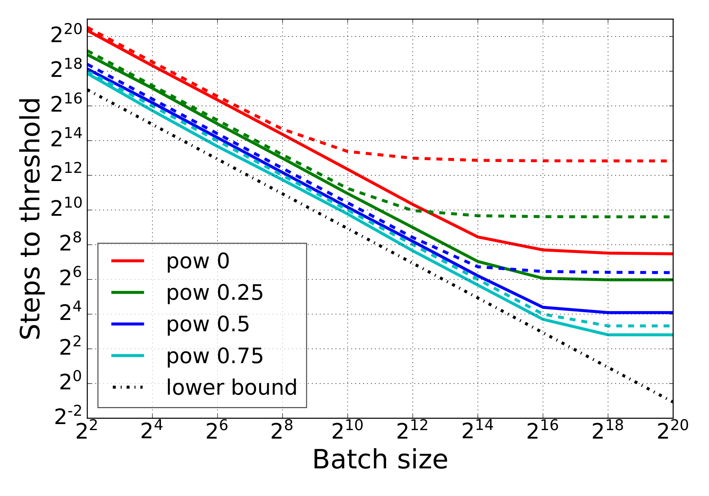
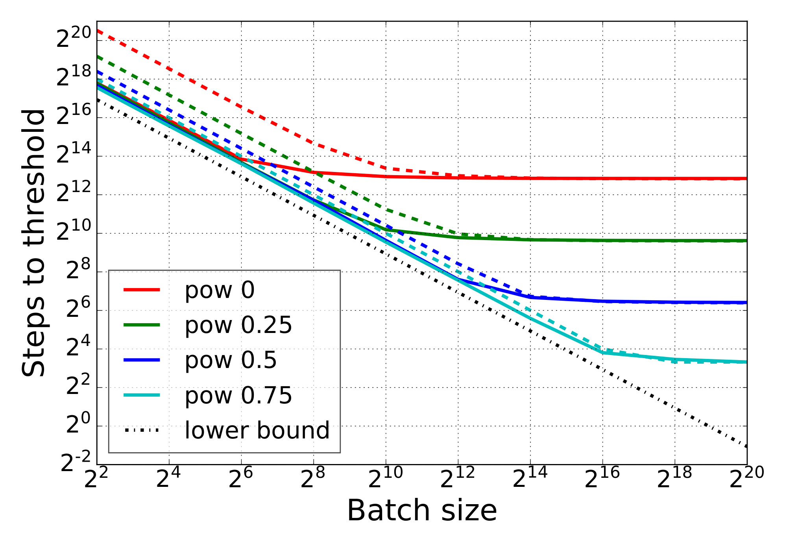

# noisy-quadratic-model

The major contributors of this repository include [Roger Grosse](https://github.com/rgrosse) and [Guodong Zhang](https://github.com/gd-zhang).

## Introduction
This repository contains the toy code to reproduce the NQM results from the paper [Which Alorithmic Choices Matter at Which Batch Sizes?](https://arxiv.org/pdf/1907.04164.pdf).

Particularly, you can reproduce our results on momentum (left figure), preconditioning (both figures), exponential moving average (right figures) and learning rate decay with this code. Here are a few figures from our paper.

<p align="center">
  
  
</p>

## Citation
To cite this work, please use
```
@inproceedings{zhang2019algorithmic,
  title={Which algorithmic choices matter at which batch sizes? insights from a noisy quadratic model},
  author={Zhang, Guodong and Li, Lala and Nado, Zachary and Martens, James and Sachdeva, Sushant and Dahl, George E and Shallue, Christopher J and Grosse, Roger},
  booktitle={Advances in Neural Information Processing Systems},
  year={2019}
}
```
